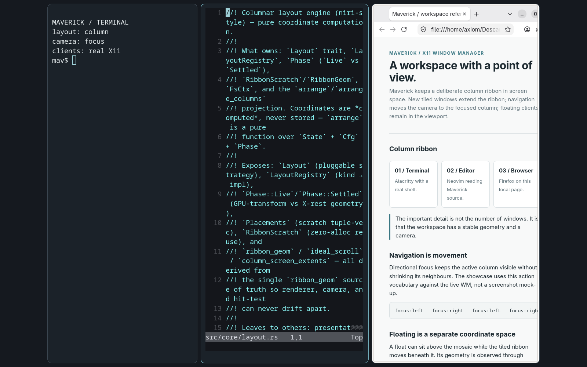
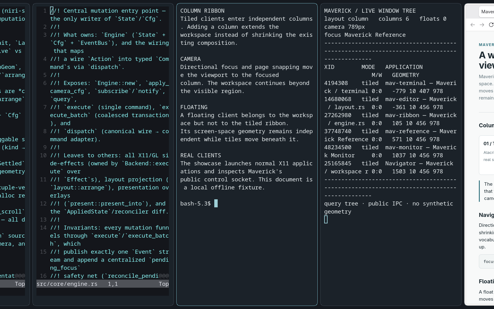
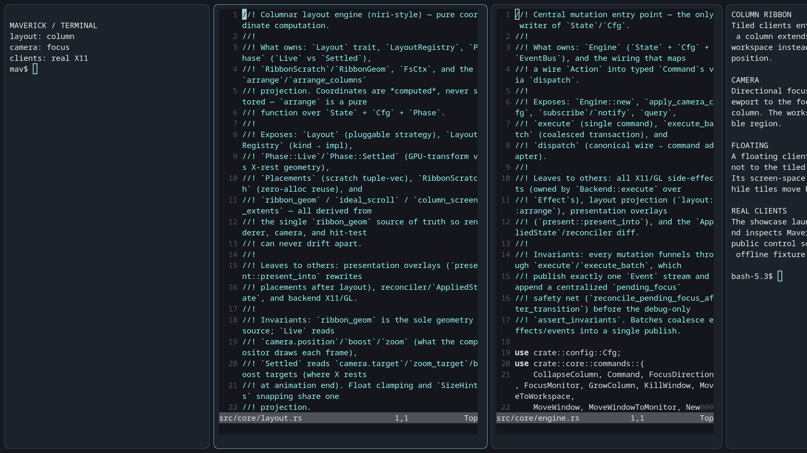
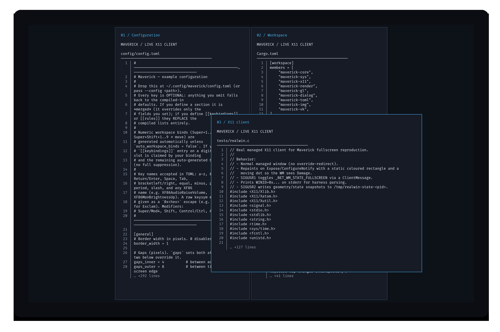
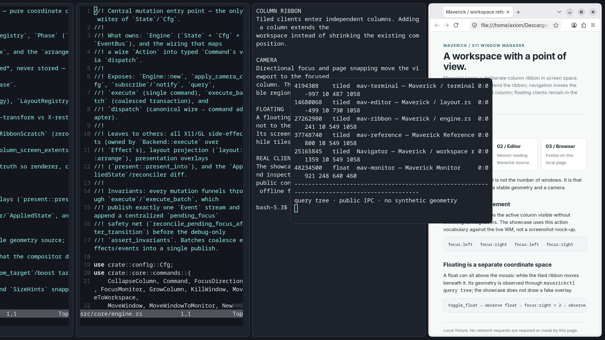

# Maverick

Maverick es un gestor de ventanas X11 experimental para Linux, escrito en Rust.
Combina un ribbon horizontal desplazable de columnas en mosaico con workspaces
por monitor y ventanas flotantes independientes. Un compositor OpenGL/GLX
opcional añade presentación animada sin adueñarse del estado de gestión de
ventanas.

[Panorámica](#panorámica) · [Diseño](#diseño) · [Instalación](#instalación) ·
[Configuración](#configuración) · [Pruebas](#pruebas) · [Capturas](#capturas)

## Panorámica

Maverick explora una alternativa espacial a encajar todas las ventanas en una
sola pantalla. Las ventanas en mosaico nuevas normalmente entran en columnas
nuevas; cada columna tiene un ancho relativo al workarea del monitor y puede
contener una pila vertical de ventanas. Añadir columnas extiende el ribbon en
lugar de encoger continuamente a sus vecinas. La navegación mueve el viewport a
través de ese ribbon, manteniendo a la vista la columna enfocada. Overview
ofrece una tira de película con zoom reducido para seleccionar una columna.

Las ventanas flotantes pertenecen a un monitor y un workspace, pero no al
ribbon. Conservan geometría en coordenadas de pantalla mientras los tiles se
desplazan. Fullscreen y maximize son políticas de presentación aplicadas sobre
la colocación lógica, no layouts separados.

Esto es un proyecto de sistemas X11, no un entorno de escritorio ni un
compositor Wayland. Usa propiedades de cliente X11, monitores RandR y un bucle
de reconciliación para conectar un modelo de estado testeable con ventanas de
aplicaciones reales. No incluye panel, servicio de notificaciones, pantalla de
bloqueo ni lanzador de aplicaciones.

## Funcionalidades

### Gestión de ventanas y navegación

- Un único layout en mosaico: columnas con desplazamiento horizontal y pilas
  verticales de ventanas.
- Foco y movimiento direccionales, anchos de columna ajustables, operaciones de
  columna nueva y colapso de columna.
- Cámaras por workspace, zoom de viewport, page-snap scrolling y selección con
  Overview.
- Bordes, gaps, temas, keybindings y reglas de aplicación configurables.
- Comandos por socket Unix, consultas de estado en JSON y suscripción a eventos.

### Ventanas flotantes y fullscreen

- Colocación flotante por tipos de ventana/transients, reglas o conmutador
  explícito.
- Movimiento y redimensionado con modificador de ventanas **ya flotantes**.
- Ventanas sticky, geometría por regla y manejo de size hints del cliente.
- Fullscreen, maximize al workarea y una política exclusiva `true_fullscreen`
  para aplicaciones que deben abandonar por completo la presentación del ribbon.
- Reglas para aceptar o rechazar el estado fullscreen inicial y posterior del
  cliente.

### Multi-monitor

- Descubrimiento de monitores RandR y actualizaciones de topología, con
  workspaces por monitor.
- Foco y movimiento de ventanas entre monitores.
- Workareas derivados de reservas de docks (`_NET_WM_STRUT_PARTIAL` /
  `_NET_WM_STRUT`).

### Renderizado y comportamiento de sesión

- Operación X11 pura sin el compositor integrado; los cambios de geometría se
  asientan de inmediato, sin animación de spring.
- Renderizado OpenGL/GLX opcional: animación de scroll/zoom, opacidad de
  ventanas, esquinas redondeadas, fondo de pantalla con imagen y fondo GLSL.
- Fondo de imagen estático vía pixmap raíz incluso sin compositor.
- Reinicio en sitio, adopción de ventanas existentes con `--replace` y sockets
  de control aislados para múltiples instancias de Maverick.
- Tests unitarios/de regresión en Rust y harnesses de integración separados
  sobre X11 real.

Vulkan es un **bootstrap experimental no integrado**, no un compositor
alternativo funcional. Véase [Compositor](#compositor) y
[Estado actual](#estado-actual).

## Diseño

La distinción central es entre **colocación lógica**, **presentación
deseada** y **el estado aplicado por última vez a X11**.

```text
Acciones de tecla / puntero / IPC       Eventos del ciclo de vida X11
              |                           |
              v                           v
         Engine / Command ----------> State + Cfg
              |                           |
           Effects                 layout::arrange
              |                  + present::present_into
              |                           |
              +----> backend X11 <--- DesiredState
                          |
                      Reconciler ----> AppliedState
                          |
                          v
                         X11

State + Cfg -- layout Phase::Live --> compositor OpenGL opcional
```

`maverick-core` define los tipos del dominio, incluyendo clientes, columnas,
workspaces, cámaras y rectángulos. Los módulos de `src/core/` implementan el
motor, los comandos, el layout, la presentación y el traspaso del estado
deseado. Mantener los manejadores de protocolo fuera del modelo de dominio
permite probar la geometría y las transiciones sin un servidor X.

`layout::arrange` proyecta un workspace en rectángulos;
`present::present_into` aplica la presentación de fullscreen/maximize. El
`Reconciler` del backend compara `DesiredState` con su contabilidad de
`AppliedState` y emite los cambios de geometría/borde. El backend X11
circundante maneja visibilidad, apilado y foco por separado. El estado
aplicado es una caché del backend, no una afirmación de que las peticiones
X11 asíncronas nunca puedan fallar.

El layout tiene dos fases. `Phase::Settled` usa los objetivos de cámara para
la geometría enviada a X11. `Phase::Live` usa valores de cámara interpolados
para el dibujado del compositor. La misma matemática de proyección sirve a
ambas: las animaciones mueven texturas en lugar de redimensionar ventanas X
en cada frame del spring. Sin compositor, los cambios de estado van directo a
geometría asentada.

El ribbon es un sistema de coordenadas lógico, no otra pantalla X11. Su
proyección incluye el origen global del monitor y el workarea; X11 sigue
viendo ventanas ordinarias en el espacio de coordenadas raíz. Las ventanas
flotantes están deliberadamente fuera de la transformación del ribbon. Esta
separación importa en escritorios multi-monitor y al hacer scroll, zoom o
restaurar geometría de fullscreen. El scrolling es una transformación interna
del layout sobre el desktop físico: `_NET_DESKTOP_GEOMETRY` y `_NET_WORKAREA`
permanecen físicos, y Maverick no publica `_NET_DESKTOP_VIEWPORT`.

## Ventanas flotantes

Una ventana puede flotar porque es un transient/diálogo, coincide con
heurísticas de flotación (como hints de tamaño fijo) o una regla, o se
conmuta con `Super+Shift+Space`. Las reglas pueden especificar tamaño y
posición; las posiciones de regla son relativas al origen del workarea. La
colocación inicial normalmente centra un float sobre la geometría almacenada
de su padre transitorio, o en el workarea de su monitor asignado. La
geometría flotante persistida puede tener precedencia al adoptar. Cada
ventana gestionada pertenece o bien a una columna o bien a la lista de floats
del workspace, nunca a ambas.

- **Aislamiento espacial:** los floats usan coordenadas X11 globales. El
  scrolling del ribbon, el redimensionado de columnas y la proyección de
  Overview no los escalan ni trasladan. Los floats ordinarios siguen la
  visibilidad del workspace; los floats sticky permanecen visibles entre
  cambios de workspace en su monitor.
- **Propiedad de la geometría:** cuando el WM coloca o mueve un float a un
  contexto nuevo, asienta la geometría contra los size hints y el workarea.
  Un rectángulo flotante reclamado por el cliente se conserva en lugar de ser
  renormalizado repetidamente por el layout. Arrastrar, reglas, movimientos
  de monitor/workspace o cambios de workarea pueden reclamar esa geometría
  para colocación del WM. Esto evita autoridades de redimensionado en
  competencia.
- **Movimiento:** `Super+arrastrar-izquierdo` mueve y `Super+arrastrar-derecho`
  redimensiona un float. Soltarlo sobre un tile no lo inserta en la columna.
  Arrastrar con modificador una ventana en mosaico no hace nada; usa el
  movimiento por teclado para los tiles.
- **Apilado:** los floats ordinarios se colocan sobre los tiles ordinarios,
  pero esto no es una garantía universal de "siempre encima". Las ventanas de
  fullscreen/maximize presentadas, las relaciones de transients, el orden de
  foco y las ventanas X11 no gestionadas también afectan a la pila final.
- **Fullscreen:** la entrada promueve temporalmente un float a la topología en
  mosaico y registra su modo y geometría previos. La salida restaura la
  pertenencia flotante y el rectángulo guardado, sujeto a normalización de
  colocación. Una conmutación ordinaria de tile a float, en cambio, parte del
  rectángulo actual del tile.
- **Foco por teclado:** el foco direccional sigue columnas/filas;
  `focus:next` y `focus:prev` pueden incluir floats vía historial de foco. El
  `move` direccional no ofrece movimiento por píxeles para floats.

Los clientes en mosaico no controlan su rectángulo de layout mediante
`ConfigureRequest`; el WM responde con su geometría asignada. Las peticiones
flotantes reclamadas por el cliente se acotan por seguridad del protocolo
X11, no se constriñen continuamente al workarea. Durante un arrastre activo,
el WM conserva la autoridad de geometría.

### Fullscreen y navegación

La entrada a fullscreen actualmente selecciona presentación exclusiva,
cubriendo el monitor sin borde. La navegación explícita izquierda/derecha a
otra columna devuelve ese overlay al fullscreen del ribbon conservando su
flag de fullscreen y su snapshot de restauración: puede salir de vista con
scroll y volver a llenar el monitor al regresar. Un overlay exclusivo no se
limita a elevarse o descartarse cuando cambia el foco. Maximize usa en cambio
el workarea (también sin borde), con bits de estado horizontal y vertical
independientes. Estas políticas aún evolucionan; fullscreen no es ni un tile
del ribbon permanentemente fijado ni un bloqueo de entrada universal.

## Compositor

La gestión de ventanas no requiere el compositor integrado. Desactivarlo es
un modo de operación soportado, útil para una ruta de renderizado más simple,
pruebas en X anidado o ejecutar un compositor X11 externo. No desactiva
tiling, floating, workspaces ni fullscreen.

### Sin el compositor integrado

```bash
MAVERICK_NO_COMPOSITOR=1 maverick
```

Alternativamente, pon `[compositor] enabled = false`, o compila el WM con
`--no-default-features`. Los cambios de geometría son inmediatos. El fondo
estático se pinta vía pixmap raíz de X11; el fondo GLSL requiere la ruta GL.
Las esquinas redondeadas pueden usar la ruta Shape de X11. Un compositor
externo es dueño de sus propios efectos; las animaciones GPU de Maverick no
se le delegan.

### OpenGL

La **compilación Cargo** por defecto incluye `compositor-opengl`. La
implementación usa OpenGL 3.3, texture-from-pixmap de GLX y la conexión X11
compartida del WM. `libGL.so.1` se carga en tiempo de ejecución. La
inicialización puede retroceder a X11 puro si GL no está disponible, falla la
creación del contexto u otro compositor posee la selección de pantalla.

Los efectos implementados son opacidad de ventana
(`_NET_WM_WINDOW_OPACITY`, también configurable por regla), esquinas
redondeadas y fondo de pantalla — no blur ni sombras. El redibujado parcial
necesita `GLX_EXT_buffer_age` y un back buffer utilizable; si no, los frames
se redibujan completos. El bypass de fullscreen depende de la presentación y
el apilado reales, no está garantizado para cada cliente fullscreen.

El instalador trata esta ruta como experimental y por defecto usa una
compilación sin compositar. La compatibilidad de drivers y servidores
anidados necesita pruebas; un flag de configuración por sí solo no es
evidencia de que el compositor GL haya arrancado.

### Vulkan

`maverick-vk` contiene infraestructura de instance/device/surface/swapchain
y una ruta de clear/present. El feature raíz `compositor-vulkan` es un
placeholder; no conecta ese crate al WM. Poner `backend = "vulkan"`, incluso
con el feature, **no** ofrece un compositor Vulkan funcional. Usa OpenGL o
X11 puro.

## Instalación

### Dependencias (Arch Linux)

Se requieren Linux, un servidor X11, un enlazador C y Rust. Los manifiestos
del workspace declaran edición 2021 y Rust **1.82** como mínimo; el CI actual
usa Rust estable.

```bash
sudo pacman -S --needed base-devel rust libx11 libxcb
# Para una sesión X11 arrancada con startx:
sudo pacman -S --needed xorg-server xorg-xinit
# Para la ruta OpenGL opcional:
sudo pacman -S --needed mesa libxcomposite
```

Los bindings compilados de lanzamiento usan `alacritty` y `rofi`; instálalos
o sobreescribe los bindings. El autostart compilado lanza
`xdg-desktop-portal` y `xdg-desktop-portal-gtk`; usa una lista de autostart
explícita para cambiarlo o desactivarlo. Esas aplicaciones no las requiere el
motor de layout. El fondo con imágenes no PNG puede necesitar `ffmpeg` o
ImageMagick como conversor.

### Compilar

```bash
git clone https://github.com/Azytar/Maverick.git
cd Maverick
cargo build --release --workspace
```

Para un WM sin GL, selecciona los paquetes de runtime explícitamente:

```bash
cargo build --release --no-default-features \
  -p maverick -p maverick-sys
```

Los binarios de runtime son `maverick` (el gestor de ventanas) y `maverickctl`
(herramienta de control y de sesiones), bajo `target/release/`. Esos dos son
toda la superficie orientada al usuario. Ningún crate instalador de Rust forma
parte del workspace.

### Instalar

Ejecuta el instalador como tu usuario normal. El valor por defecto es una
instalación por usuario que no necesita privilegios:

```bash
./install.sh
```

Esto compila e instala en `$HOME/.local`, así que asegúrate de que esté en
`PATH`:

```bash
export PATH="$HOME/.local/bin:$PATH"
```

Otras formas:

```bash
# Sin compositor: build X11 puro, el valor por defecto recomendado.
./install.sh --yes --without-compositor
# Instalación en todo el sistema, en /usr/local.
./install.sh --system
# Cualquier prefijo explícito.
./install.sh --prefix /opt/maverick
# Optar explícitamente por la compilación GL experimental.
./install.sh --yes --with-compositor
# Publicar además el archivo de sesión donde lo lee un display manager.
./install.sh --system --xsessions-dir /usr/share/xsessions
```

El prefijo es una frontera estricta: el instalador no escribe nada fuera del
prefijo indicado y nunca ejecuta `sudo`. Un prefijo en el que no puedas
escribir se informa como error de permisos en lugar de escalarlo, así que una
instalación en todo el sistema necesita que tú mismo arregles el acceso de
escritura a `/usr/local` — el instalador te lo dirá claramente si no lo tiene.

La entrada de sesión se escribe dentro del prefijo
(`$prefix/share/xsessions`). Los display managers normalmente solo leen
ubicaciones del sistema, y por eso publicarla en otro sitio es la opción
explícita `--xsessions-dir` y no algo que el instalador haga por su cuenta.

El instalador compila binarios release, ofrece/siembra configuración y
conserva una config existente con `--yes`. Usa `--no-config` para evitar la
creación de config. Ejecuta cada binario instalado antes de informar del éxito,
así que una instalación parcial o obsoleta falla de forma ruidosa en lugar de
anunciarse como completa. Su primer intento de compilación usa
`-C target-cpu=native`, así que usa una compilación Cargo normal cuando
produzcas artefactos para otras máquinas.

`CARGO_TARGET_DIR` se respeta tal cual, incluso si ya contiene artefactos de
una compilación anterior. Si no está definido, el directorio de compilación es
un directorio de caché bajo `$XDG_CACHE_HOME`; el checkout nunca se usa como
directorio de compilación. Véase `./install.sh --help` para las opciones
restantes.

Para desinstalar, borra los dos binarios de `$prefix/bin` y el archivo de
sesión de `$prefix/share/xsessions`. No se instala nada más en el prefijo; el
único otro archivo que el instalador puede escribir es tu propio
`~/.config/maverick/config.toml`, y un log de compilación retenido bajo
`~/.local/share/maverick/` si usas `--keep-log`.

## Ejecución

### Sesión X11

Para `startx`, pon esto al final de `~/.xinitrc` después de cualquier
preparación de sesión:

```sh
exec maverick
```

Alternativamente selecciona la sesión Maverick instalada en un display
manager. No arranques un segundo WM accidentalmente sobre tu display en vivo.
`maverick --replace` solicita deliberadamente un traspaso del WM existente y
adopta sus ventanas.

```bash
maverick --check-config "$HOME/.config/maverick/config.toml"
maverick --config "$HOME/.config/maverick/config.toml" --name desktop
maverick --help
```

`--check-config [path]` valida sin iniciar X11 y devuelve `0` para una
configuración limpia o `1` para diagnósticos. `--config` lo reutilizan
reload/restart. `--name` etiqueta la instancia; `--version` imprime la
versión.

### X11 anidado y depuración

Usa el [showcase](#reproducción-de-las-capturas) para una sesión Xephyr
aislada con configuración privada, clientes controlados y limpieza
automática. Xephyr requiere un display X padre accesible; en Wayland esto
normalmente significa Xwayland.

Para diagnósticos, compila con los features opt-in `input-trace` y/o
`window-trace` y captura el stderr del WM en una sesión de prueba:

```bash
cargo build -p maverick --features input-trace,window-trace
MAVERICK_NO_COMPOSITOR=1 ./target/debug/maverick --config /path/to/test.toml \
  2> /tmp/maverick-debug.log
```

Ejecuta lo segundo **solo en tu `DISPLAY` de prueba previsto**. Estos
features añaden trazas estructuradas de entrada/foco o de
estado-deseado/aplicado/X11; están apagados en compilaciones normales.

## Configuración

La configuración es opcional. Maverick busca
`$XDG_CONFIG_HOME/maverick/config.toml`, recurriendo a
`~/.config/maverick/config.toml`. Lo que falte usa los defaults compilados.

Una configuración pequeña basta:

```toml
[general]
column_width = 0.5
gaps_inner = 10
gaps_outer = 14
focus_mouse = false

[compositor]
enabled = false
```

Omitir `[autostart]` conserva los defaults compilados; véanse las notas de
autostart más abajo sobre cómo funciona el reemplazo de listas.

Valídala antes de aplicar `maverickctl reload`. Un TOML malformado recae en
los defaults compilados; las entradas individuales inválidas se diagnostican
y se ignoran. Toma los avisos en serio — recaer en defaults también puede
cambiar bindings y autostart.

El [ejemplo comentado](config/config.toml) lista el vocabulario de
configuración más amplio. Es un preset, **no una copia exacta de los defaults
compilados**: copiarlo cambia bindings, reglas y autostart. En particular:

- Los ajustes ordinarios se fusionan con los defaults. `[[keybindings]]` y
  `[[rules]]` reemplazan sus respectivas listas compiladas cuando se proveen.
- Los bindings numéricos de workspace rellenan los slots libres salvo
  `auto_workspace_binds = false`. `n_tags` está limitado a 1–9.
- `column_width` es una fracción del workarea (0.1–1.0); `accordion_boost`
  vale `0.0` por defecto, así que la expansión de la columna enfocada es
  opt-in.
- `[animations] enabled = false` fija las transiciones de cámara/zoom aun con
  GL activo. `stiffness` y `damping` ajustan el spring.
- `[colors]` acepta valores `0xRRGGBB` para `normal`, `focused` y `urgent`,
  sobreescribiendo un preset `[general] theme`.

### Enlaces compilados esenciales

`Super` significa Mod4 (normalmente la tecla Windows). La configuración de
ejemplo y la generada por el instalador pueden sobreescribir estos defaults.

| Binding | Acción |
| --- | --- |
| `Super+Return` / `Super+P` | Terminal / lanzador de aplicaciones |
| `Super+H/J/K/L` | Foco izquierda/abajo/arriba/derecha |
| `Super+Shift+H/J/K/L` | Mover ventana izquierda/abajo/arriba/derecha |
| `Super+Shift+Return` | Poner ventana en una columna nueva |
| `Super+Ctrl+H/L` / `Super+Ctrl+J` | Encoger/agrandar columna / colapsar en la columna previa |
| `Super+Shift+Space` | Conmutar flotante |
| `Super+Shift+F` / `Super+Shift+M` | Conmutar fullscreen / maximize |
| `Super+O` / `Super+E` | Conmutar Overview / entrar en su selección |
| `Super+N` / `Super+Shift+O` | Selección de Overview derecha / izquierda |
| `Super+=/-` / `Super+]/[` | Zoom de viewport / page-snap derecha/izquierda |
| `Super+1…9` / `Super+Shift+1…9` | Cambiar de workspace / enviar ventana al workspace |
| `Super+Tab` / `Super+Shift+Tab` | Foco al monitor siguiente / enviar ventana al monitor siguiente |
| `Super+wheel` | Foco de columna por pasos |
| `Super+Shift+C` | Cerrar ventana enfocada |
| `Super+Shift+R` o `Super+F5` | Reinicio en sitio |
| `Super+Shift+Q` | Salir de inmediato (apagado nativo limpio, sin diálogo) |

Los bindings personalizados usan entradas como `key = "Mod4+Return"` y
`action = "spawn:xterm"` dentro de `[[keybindings]]`. Recuerda que proveer
uno reemplaza la lista compilada de bindings no-workspace. El parser de
acciones canónico es [`src/core/action.rs`](src/core/action.rs).

### Reglas de aplicación

`class`, `instance` y `title` coinciden por subcadena sin distinguir
mayúsculas. `window_type` coincide con un nombre de tipo normalizado
completo, como `dialog` o `utility`. Múltiples criterios en una regla deben
coincidir todos.

```toml
[[rules]]
class = "calculator"
float = true
size = [480, 360]
position = [120, 100]
```

Las reglas también aceptan `sticky`, `workspace` (base 1), `opacity` y
`border_width`. El fullscreen/maximize pedido por el cliente al mapear se
normaliza normalmente; `honor_initial_state` opta globalmente o por regla,
mientras `ignore_initial_state` fuerza la normalización. `deny_fullscreen`
rechaza peticiones EWMH fullscreen del cliente, no el toggle del usuario.
`true_fullscreen` selecciona una política de overlay exclusiva y tiene
precedencia sobre esa denegación.

### Fondo de pantalla y autostart

```toml
[wallpaper]
path = "~/Pictures/wallpaper.png"
mode = "fill"
```

Los modos de imagen son `fill`, `fit`, `stretch` y `center`. La decodificación
de PNG, PPM/PNM, QOI, BMP básico y farbfeld está en el árbol; otros formatos
(o fallos de decodificación nativa) usan conversión externa. Con GL activo,
los fondos `.glsl`/`.frag` pueden usar `u_time`, `u_resolution` y
`u_delta_time`. El fondo de vídeo no tiene implementación. El viejo comentario
del ejemplo sobre "requiere compositor" para imágenes no aplica a la ruta
actual de pixmap raíz estático.

`[autostart] commands` es una lista de listas de argumentos, por ejemplo
`commands = [["polybar", "main"]]`. Proveer una lista no vacía reemplaza la
compilada; no hay override documentado con lista vacía, y una entrada vacía
se descarta con aviso. Usa aplicaciones compatibles con X11; un panel solo
Wayland no se vuelve compatible por listarlo aquí. Los docks que publican
struts reservan workarea. El arranque de sesión y el restart no son un
supervisor de servicios de propósito general.

## Control y ciclo de sesión

```bash
maverickctl list
maverickctl state --name desktop
maverickctl query tree --name desktop
maverickctl msg focus-left --name desktop
maverickctl subscribe --name desktop
maverickctl reload --name desktop
maverickctl restart --name desktop
maverickctl quit --name desktop --confirm
```

`maverickctl` también reenvía líneas de acción, por ejemplo
`maverickctl view 3` o `maverickctl wallpaper clear`. Cada instancia tiene
un directorio de runtime privado y un socket Unix bajo
`$XDG_RUNTIME_DIR/maverick/<session-id>/`. El descubrimiento comprueba
identidad de proceso y actividad del socket. La selección prefiere
`--session`, luego `--name`, luego el `MAVERICK_INSTANCE` heredado, luego el
contexto de display/TTY; también se puede seleccionar un singleton global.
Usa targeting explícito al probar junto a una sesión en vivo.

**Quit cierra las aplicaciones gestionadas de la sesión**, no solo el WM. El
apagado pregunta a los clientes vía `WM_DELETE_WINDOW` y luego fuerza el
cierre de los supervivientes tras una espera acotada (tres segundos). Guarda
tu trabajo antes de salir. Restart es una ruta separada de re-ejecución en
sitio con recuperación de topología/geometría, no un login de escritorio
nuevo.

## Pruebas

### Comprobaciones Rust

```bash
cargo check
cargo test --workspace
cargo clippy --workspace --all-targets -- -D warnings
```

`cargo check` comprueba la configuración de paquete/compilación por defecto;
los tests del workspace también ejercitan los crates de soporte. Los tests
cubren layout e invariantes de estado, transiciones de
presentación/foco, convergencia de geometría flotante, parseo de
configuración y acciones, descubrimiento IPC/sesión, decodificación de
imágenes y helpers del renderer. No constituyen un test de compatibilidad de
compositor con driver real ni de aplicaciones. Algunos tests de integración
Vulkan requieren opt-in explícito y un entorno X11/Vulkan.

[CI](.github/workflows/ci.yml) ejecuta tres jobs: los tests del workspace con
Clippy estricto, las comprobaciones del instalador (`bash -n` más
`tests/install-smoke.py`), y un job de smoke X11 que compila el perfil
`--no-default-features` y lanza la regresión de apilado con Xvfb. No ejecuta
los escenarios Xephyr.

### X11 real y tests del instalador

```bash
cargo build -p maverick -p maverick-sys
python3 tests/xvfb-stacking.py
python3 tests/install-smoke.py
```

La regresión de apilado Xvfb compila una sonda Xlib y comprueba el orden real
de ventanas X en un servidor privado (requiere `xorg-server-xvfb`, un
compilador C y librerías X11). El smoke test del instalador usa directorios
temporales aislados y comandos privilegiados simulados; no es una instalación
del sistema.

`tests/xephyr-*.sh` cubre interacciones fullscreen/puntero, muerte de
clientes, restart, shutdown, casos borde de IPC, fondo de pantalla, daño del
compositor y escenarios de monitores. `tests/xephyr-suite.sh` es un harness
de integración manual separado con aplicaciones reales opcionales; fuerza el
compositor integrado a off por fallos conocidos de GLX anidado. Estos scripts
**no están todos aislados con el mismo estándar**: algunos helpers antiguos
en `tests/common.sh` matan procesos por nombre o usan displays fijos.
Inspecciona un script antes de ejecutarlo, y ejecuta la suite legacy solo en
una sesión gráfica desechable, no junto a trabajo que necesites preservar.

El harness de capturas de abajo es separado: es dueño de su servidor y sus
clientes y nunca usa ese helper de limpieza global. Las capturas demuestran
estados seleccionados, no compatibilidad total de aplicaciones ni corrección
de animaciones.

## Desarrollo

El bucle normal de desarrollo es:

```bash
cargo fmt --all
cargo check
cargo test --workspace
cargo clippy --workspace --all-targets -- -D warnings
```

Usa `cargo fmt --all -- --check` para una comprobación de formato de solo
lectura. La deriva de formato existente debe manejarse por separado en lugar
de mezclarla en un cambio de documentación o comportamiento. Mantén el
trabajo nuevo de layout/política cubierto por tests de estado puros; usa un
servidor X aislado para comportamiento de protocolo, apilado y foco. Al
cambiar código del compositor, valida en un driver real además de cualquier
servidor anidado que soporte la ruta GLX requerida.

## Arquitectura

| Ubicación | Responsabilidad |
| --- | --- |
| `src/main.rs` | CLI, selección de configuración, señales, vida útil de instancia/control, arranque del backend |
| `maverick-core/` | Tipos de dominio sin dependencias y modelo de fuente de fondo |
| `src/core/` | Motor, acciones/comandos/efectos/eventos, layout, presentación, estado deseado, recuperación de sesión |
| `src/backend/x11/` | Manejo de eventos, gestión de clientes, entrada, EWMH, struts, reconciliación, planificación de frames, fondo raíz |
| `src/config.rs`, `src/userconfig.rs` | Defaults compilados, fusión de config, validación |
| `maverick-x11/` | Arranque de conexión Xlib/XCB compartida |
| `maverick-sys/` | Identidad/descubrimiento de instancias, socket/hub de control, el modelo Maverick Session, `maverickctl` |
| `maverick-render/` | Tipos y trait orientados al renderer; ningún backend del árbol implementa `Renderer` todavía |
| `maverick-gl/` | Renderer OpenGL/GLX y FFI/carga en el árbol |
| `maverick-vk/` | Código experimental de device/surface/swapchain Vulkan, no integrado al WM |
| `maverick-toml/`, `maverick-img/` | Parser TOML-subset y decodificador PNG/conversión externa de imágenes |
| `tests/` | Sondas X11 reales y scripts de integración, smoke tests del instalador |
| `showcase/` | Harness aislado y reproducible de presentación técnica |

El crate de dominio no es toda la máquina de estados: el `src/core/` del
ejecutable contiene buena parte de esa lógica. El acceso X11 usa `x11rb` con
una conexión FFI XCB; no es una pila de protocolo totalmente pura en Rust. La
implementación no requiere GUI-toolkit ni runtime asíncrono, pero sigue
dependiendo de librerías X11 nativas.

## Project Layout

```text
.
├── src/                 # Gestor de ventanas principal
├── maverick-core/       # Estado compartido y tipos centrales
├── maverick-x11/        # Integración X11
├── maverick-gl/         # Compositor OpenGL
├── maverick-vk/         # Backend Vulkan
├── maverick-render/     # Tipos/trait de renderer (sin implementador en el árbol)
├── maverick-img/        # Soporte de imágenes
├── maverick-toml/       # Soporte TOML/config
├── maverick-sys/        # Interfaces IPC/control
├── config/              # Configuración de ejemplo
├── docs/                # Recursos de documentación
├── showcase/            # Presentación técnica reproducible
└── tests/               # Tests de integración y X11
```

`maverick-vk` es un bootstrap experimental no integrado (véase
[Compositor](#compositor)); no es un backend de compositor funcional.

`maverick-render` define del mismo modo un trait `Renderer` agnóstico al
backend y los tipos de valor compartidos, pero ningún crate del workspace
implementa ese trait todavía — `maverick-gl` aporta su propio tipo `Renderer`,
sin relación con él. Actualmente el crate solo se reexporta desde
`src/backend/renderer.rs` y lo usan sus propios tests de contrato.

## Estado actual

Maverick está en desarrollo activo y no se declara listo para producción. La
ruta X11 pura implementa el modelo actual de tiling, navegación, floating,
fullscreen y workspaces; la suite de regresión existe para endurecer esas
interacciones.

- **Renderizado experimental:** OpenGL está implementado pero sigue siendo
  opcional y sensible a drivers. Vulkan no está conectado a la composición de
  ventanas.
- **Alcance:** solo Linux/X11; sin backend Wayland, shell de escritorio
  integrado, blur, sombras ni fondo de vídeo.
- **Layout:** Column es el único layout implementado. Los índices de
  workspace están limitados a 1–9; los nombres son cosméticos.
- **Compatibilidad:** el soporte ICCCM/EWMH está implementado para las
  necesidades del WM, no como afirmación general de protocolo completo o
  compatibilidad de aplicaciones.
- **Monitores:** el foco/movimiento cicla el orden de enumeración de
  monitores, no la dirección física. La recuperación de topología usa
  rectángulos/índices, no identidades de conector estables; no asumas que un
  hotplug/reorden arbitrario preserva asignaciones.
- **Geometría:** X11 tiene un espacio global de coordenadas raíz y límites de
  tamaño/coordenadas del protocolo. La proyección de scroll y los workareas
  multi-monitor deben respetar esos límites.
- **Interfaces:** configuración, APIs internas, política de presentación y
  comportamiento experimental del renderer pueden cambiar. El parser TOML del
  árbol soporta un subconjunto, no toda la especificación TOML.

## Hoja de ruta

Direcciones respaldadas por el código actual y el andamiaje de tests, sin
fechas de release prometidas:

- Extender la cobertura de regresión con clientes reales para geometría
  flotante, foco, fullscreen, restart y cambios de monitor/workarea.
- Endurecer el arranque OpenGL, el manejo de daño, el bypass de fullscreen y
  la cobertura de drivers.
- Evaluar integrar el bootstrap Vulkan con texturas de ventanas reales y el
  contrato del renderer antes de llamarlo backend soportado.
- Mantener fiable el fondo de imagen/shader; el vídeo queda reservado hasta
  que exista un diseño de decodificador y ciclo de recursos.

## Capturas

El showcase es una presentación técnica de seis escenas capturada desde una
sesión Xephyr aislada. Son capturas auténticas de la ventana raíz: Maverick
coloca clientes X11 reales, el harness ejecuta acciones reales y las imágenes no
se pintan ni se reconstruyen después de capturarlas.

### Workspace



Un comienzo limpio de tres columnas: un terminal real, Neovim leyendo
`src/core/layout.rs` y Firefox sobre una página local offline. La primera
composición es deliberadamente pequeña para poder leerse de un vistazo.

### Ribbon y scrolling


El mismo workspace gana otra ventana de código, un visor de referencia offline
y el monitor live. El foco direccional de Maverick mueve la cámara y deja el
ribbon más grande que el viewport. El navegador y el editor son aplicaciones
reales; las vistas de código son terminales reales ejecutando Neovim.



Un paso de foco direccional muestra otra vista del mismo conjunto de
aplicaciones reales. Es un estado de navegación, no otro escritorio simulado.

### Legibilidad



La escena parte de una composición compacta y utiliza las combinaciones reales
`Mod+Ctrl+H` y `Mod+Ctrl+L` sobre la columna enfocada. El showcase comprueba
que la columna se reduce, que `Mod+Ctrl+L` recupera un ancho más cómodo, que
no aparecen solapamientos y que el contenido real sigue siendo legible.

### Flotante aislado



`Maverick Monitor` es una aplicación Tk real que consulta
`maverickctl query tree`. Se flota con la acción `toggle_float` y se compara
antes y después de mover la cámara del mosaico: el float conserva la misma
geometría de pantalla mientras las ventanas tiled se desplazan debajo.

### Composición hero



La escena final conserva varias columnas, anchos variados, clientes reales,
scrolling y el monitor flotante independiente en una sola composición
deliberada.

### Reproducción de las capturas

La presentación vive en [`showcase/`](showcase/README.md) y usa un Xephyr
privado, directorios XDG privados, un perfil privado de Firefox y limpieza
acotada de procesos. No reemplaza el WM del host ni modifica la configuración
del usuario. La fixture local del navegador se abre con `file://` y
preferencias offline de Firefox; no necesita ningún recurso de red.

```bash
./showcase/run.sh
./showcase/run.sh floating
./showcase/run.sh --size 1440x900
```

La resolución de referencia es `1920x1080`; `--size` permite usarla en otro
display de desarrollo. El harness verifica las dimensiones de las capturas,
guarda evidencia JSON de estado y árbol en
`/tmp/opencode/mav-showcase-evidence/`, cosecha cada proceso creado y elimina
su runtime privado. Consulta [`showcase/README.md`](showcase/README.md) para
dependencias, fallbacks y limitaciones conocidas.

## Licencia

GPL-3.0. Véase [LICENSE](LICENSE).
